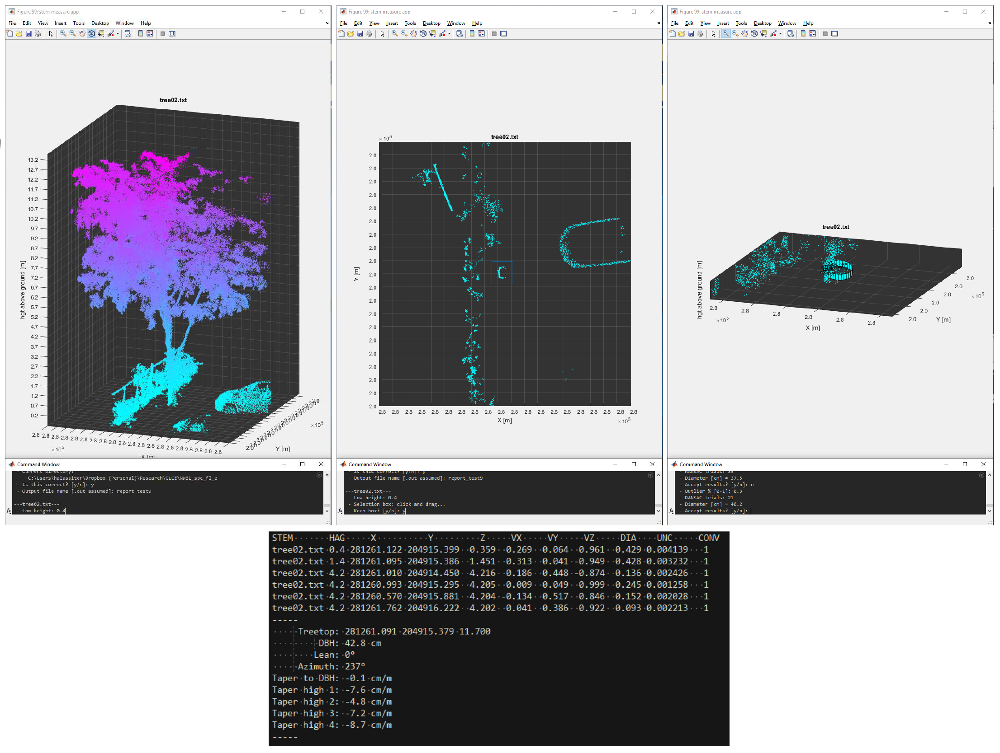
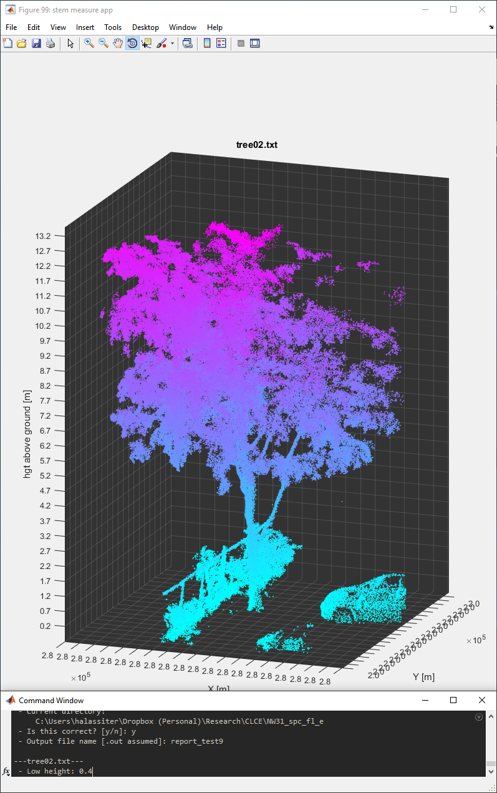
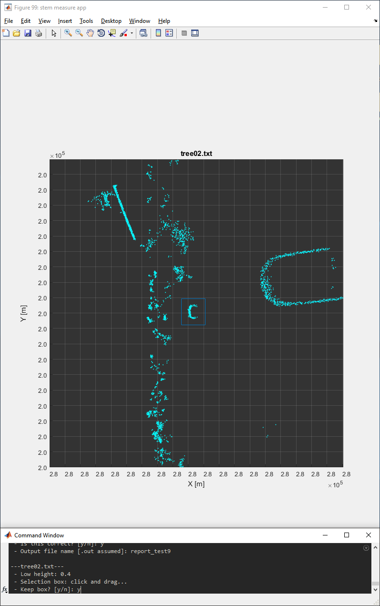
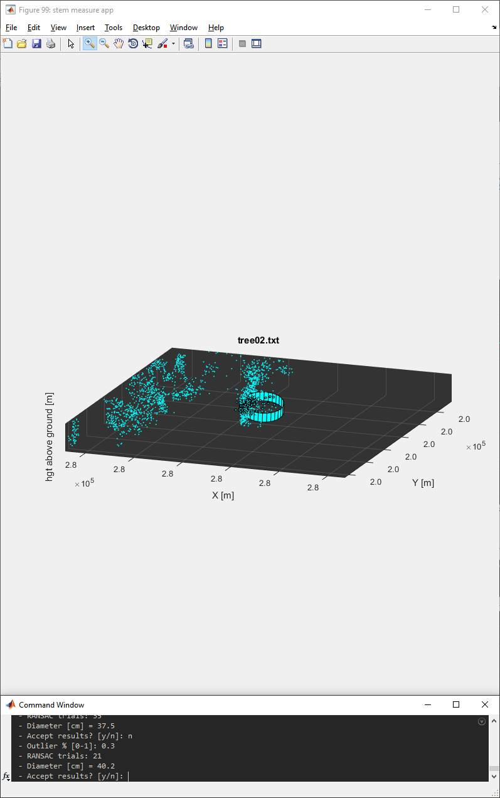

# virtual-forest-inv
A virtual forest inventory app designed for use on terrestrial or mobile lidar datasets.



*Overview of interactive windows and MATLAB terminal when using the virtual forest inventory map.*

## How to use
Add the 'cylfit_app' folder to the path in MATLAB. Then type "cylfit_app".
```
>> cylfit_app
 - Current directory:
     D:\Dropbox\Research\CLCE\cylfit_app
 - Is this correct? [y/n]: 
```
The app is asking you if this is hte directory containing the stem .txt files. 
It probably is not, if this is your first time running the app. Type "n".
```
>> cylfit_app
 - Current directory:
     D:\Dropbox\Research\CLCE\cylfit_app
 - Is this correct? [y/n]: n
 - Directory: 
```
Type the directory with the stems here, e.g. "D:\Dropbox\CLCE\NW31_spc_fl_e" 
(without the quotations).
```
 - Output file name [.out assumed]: 
```
Name your output file. This will be an ASCII file with the .out extension. The 
app wants to grab *every* file that ends with .txt, so any other file that goes
into the folder containing your stems needs to have a different extension.

Now you will begin interacting with the stem files, one by one. Follow the 
prompts in the command window. 



*The first window will be an oblique view of the text file which represents the area around the tree stem. In this example, "tree02.txt" was created by manually clipping a tree from a point cloud using CloudCompare.*

```
---tree02.txt---
 - Low height: 
```
First up, the app wants to know at what height above ground you want to measure 
the diameter of the stem. Choose a height as low as possible where the stem 
is not obstructed by shrubs, foreign objects, etc.

```
---tree02.txt---
 - Low height: 0.5
 - Selection box: click and drag...
``` 
Click/hold and drag a box across the plot to select which points belong to the
stem. You can repeat this process if you draw a bad box; the app will ask you
if you want to keep it (answer y or n).



*After entering the "low" height, a window will pop up showing a "slice" of the point cloud at height 0.4 m above ground. (Note that the input "tree02.txt" is normalized to ground level.*
```
---tree02.txt---
 - Low height: 0.5
 - Selection box: click and drag...
 - Keep box? [y/n]: y
 - Outlier % [0-1]: 
```
Give the app an outlier percentage (e.g., 0.5) for the RANSAC fitting. 
```
---tree02.txt---
 - Low height: 0.5
 - Selection box: click and drag...
 - Keep box? [y/n]: y
 - Outlier % [0-1]: 0.5
 - RANSAC trials: 35
 - Diameter [cm] = 39.9
 - Accept results? [y/n]: 
```
You can inspect the fitted cylinder on the plot. If you want to keep it, well,
you can keep it. If not, you can give a new outlier percentage (or the same 
percentage) and refit.



*Oblique view of the fitted cylinder presented for inspection.*
```
---tree02.txt---
 - low height (close to ground): 
 - Multiple stems? [y/n]: 
 - Selection box: click and drag...
 - Keep box? [y/n]: y
 - Outlier % [0-1]: 0.5
 - RANSAC trials: 35
 - Diameter [cm] = 39.9
 - Accept results? [y/n]: y

 - DBH height: 
``` 
Process is repeated at breast height.

Process is repeated again at "high" height, which is as high up the tree where 
you feel you can comfortably identify the stem. You will fillow the same process
as above, except you have the option of stating whether "codominance" is 
present. (I place htat in quotes, because you can use this to simply identify
multiple branches that may not necessarily be codominant, should you so desire.)

 Here is an example of what happens when multiple stems are present:
``` 
---Box 1---
 - Selection box: click and drag...
```
Draw a box and fit a cylinder for each of the number of stems you identify. In 
the above example, I said that there were 4 codominant stems, and I chose to ID
them at a height above ground of 4.2 m. The RANSAC prompts will be the same as 
before.

That's it! You'll move onto the next tree. If you don't want to continue, press
Ctrl+C. Go check out your results in the .out file. If you rerun the app, use a
new name for the .out file!

## Example .out file
```
STEM       HAG     X          Y         Z     VX     VY     VZ     DIA    UNC     CONV
tree02.txt 0.4 281261.122 204915.399  0.359  0.269  0.064  0.961  0.429 0.004139   1
tree02.txt 1.4 281261.095 204915.386  1.451  0.313  0.041 -0.949  0.428 0.003232   1
tree02.txt 4.2 281261.010 204914.450  4.216  0.186  0.448 -0.874  0.136 0.002426   1
tree02.txt 4.2 281260.993 204915.295  4.205  0.009  0.049  0.999  0.245 0.001258   1
tree02.txt 4.2 281260.570 204915.881  4.204 -0.134  0.517  0.846  0.152 0.002028   1
tree02.txt 4.2 281261.762 204916.222  4.202  0.041  0.386  0.922  0.093 0.002213   1
-----
     Treetop: 281261.091 204915.379 11.700
         DBH: 42.8 cm
        Lean: 0°
     Azimuth: 237°
Taper to DBH: -0.1 cm/m
Taper high 1: -7.6 cm/m
Taper high 2: -4.8 cm/m
Taper high 3: -7.2 cm/m
Taper high 4: -8.7 cm/m
-----
```

## Special thanks

> Smith, I. (2002b). LSGE lscylinder. NPL Centre for Mathematics and Scientific Computing.